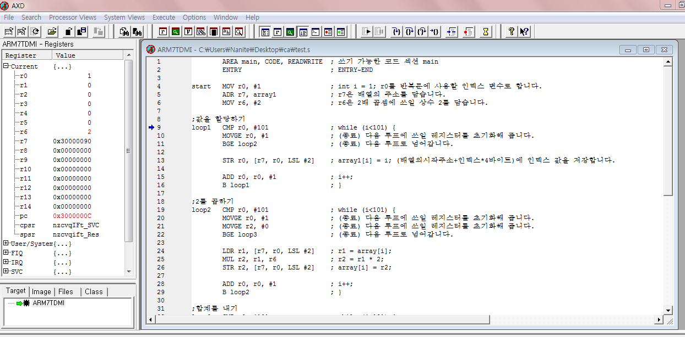
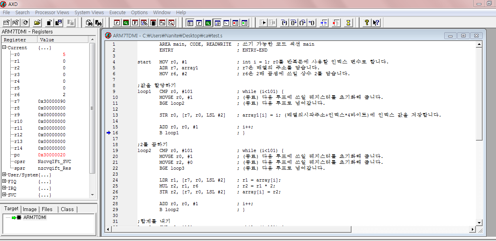
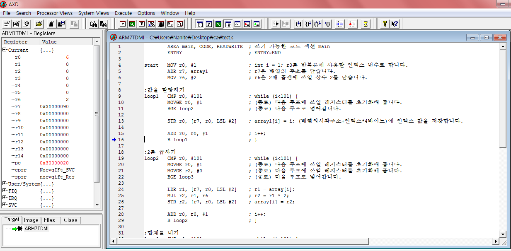
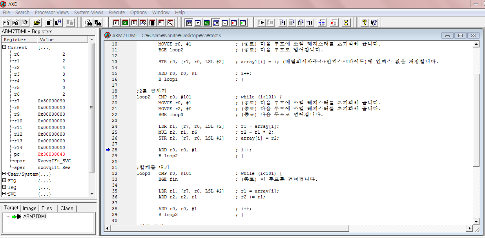
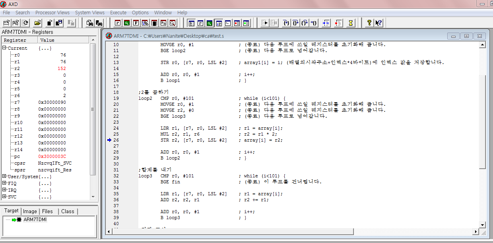
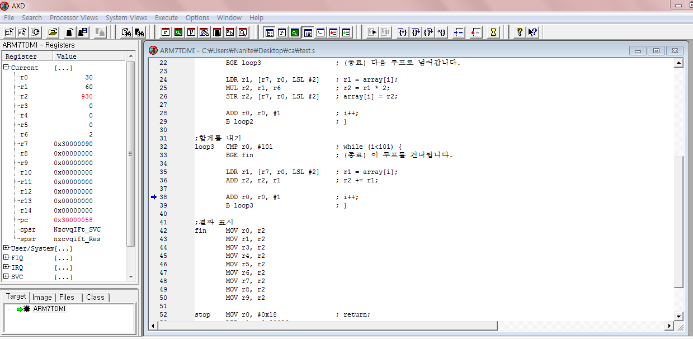
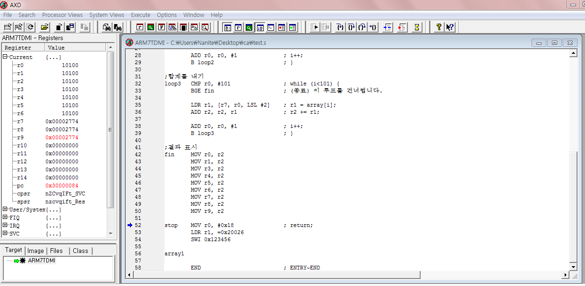

# ARM assembler practice

## 개요
- 2015학년도 2학년 2학기 '컴퓨터 구조' 수업 과제
- ARM 어셈블리 프로그램 작성
- - -
- 사용 IDE: ARM Developement Suite v1.2
- 참고자료1: [ARM Developer Suite Assembler Guide - ARM Infocenter](http://infocenter.arm.com/help/topic/com.arm.doc.dui0068b/DUI0068.pdf)
- 참고자료2: [ARM Development Suite v1.2 사용법](http://cse.hufs.ac.kr/LIBS/TOOLKIT/NWS_download/bbs_download.asp?bbs_section_cd=etc&bbs_no=2841&bbs_upload_no=2)

## 과제 목표
1) 1, … ,100을 할당하고
1) *2를 하여
1) 합계를 찍는다.
* 제출물: 소스 프로그램 및 각 어셈블 및 실행 결과

## 수행화면

